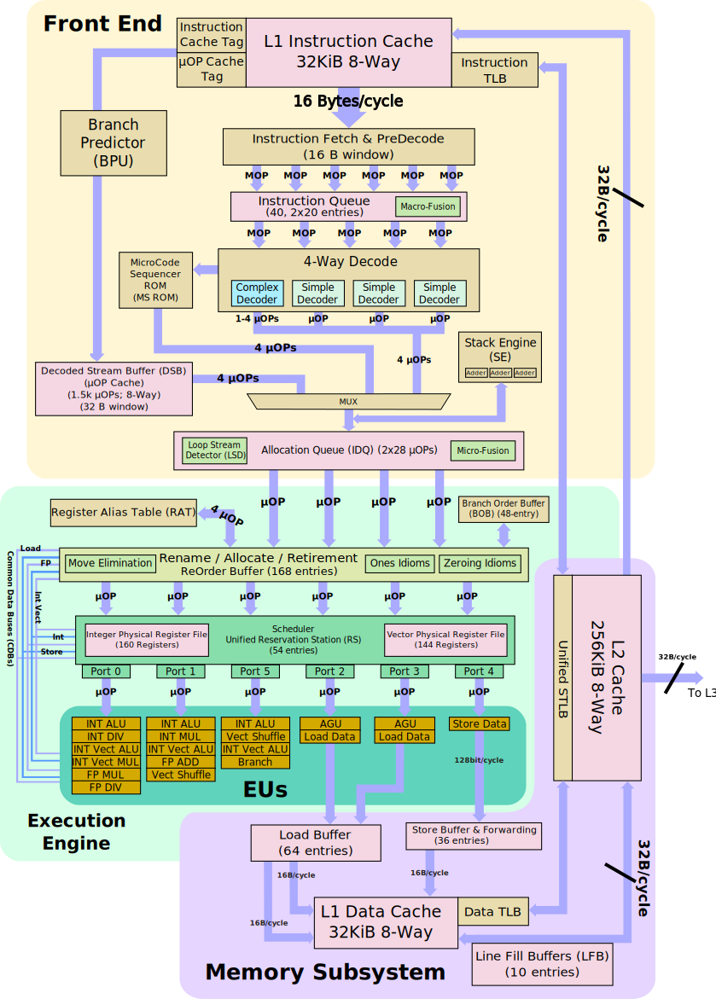
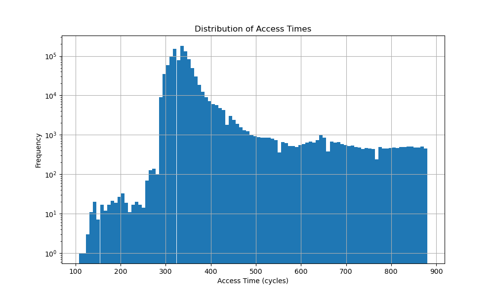
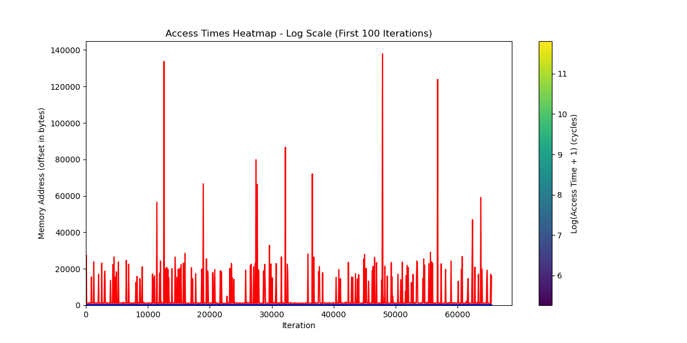
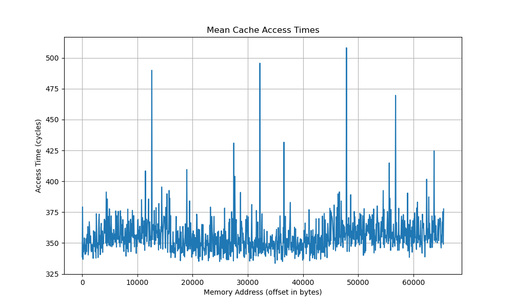
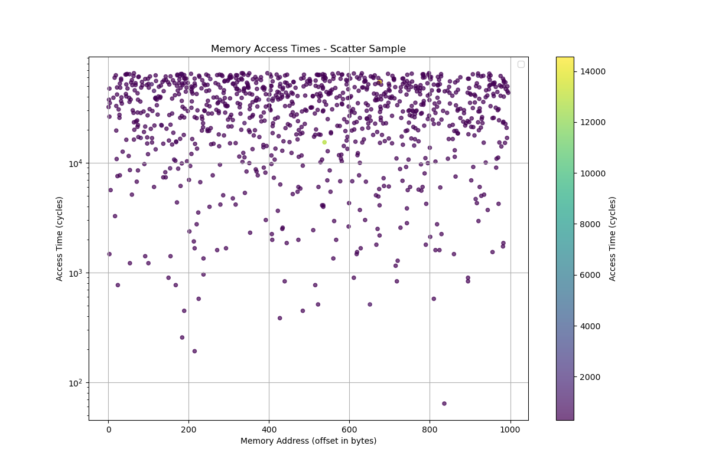

# The XYZ's of Microarchitecture Exploitation and Measurements

The following repository contains code, helpers and other miscellany of tools
useful for evaluating and measuring microarchitecture behavior for Intel CPUs
for those of us diving into microarchitecture exploitation or performance
research.

This is mostly a collection of research tools I wrote while going through
the [Microarchitecture Exploitation] module of [pwn.college] and applying
that knowledge to other hardware and in other scenarios.

## Infrastructure and Tools

The data in this repo, timings and plots have been collected on an Intel Xeon
E5-2670 CPU which is based on the [Ivy Bridge] microarchitecture.

The CPU is a two socket (two numa nodes) decacore (10 core per socket) model
with 40 threads in total with one 640KiB L1 instruction cache and 640KiB L1
data cache per core and each socket has a shared 50MB L3 cache; you can find
more details in the [lscpu](lscpu.txt) file attached.

## Examples

This section is mostly to give you an idea of what this can be useful for
due to the ethics policy of [pwn.college] I did not release exploits or
other tools I wrote while working through the module so you get the chance
to learn by yourself.

In [cache_timing.c](cache_timing.c) we demo how to run a single experiment and collect data
on it; there are two visualizer helper scripts one is for text based terminals
and one that uses `matplotlib` to generate nice plots.

Here are some nice plots.

[pwn.college]: https://pwn.college
[Microarchitecture Exploitation]: https://pwn.college/system-security/speculative-execution/
[Ivy Bridge]: https://en.wikichip.org/wiki/intel/microarchitectures/ivy_bridge_(client)

## License

[MIT](LICENSE)
